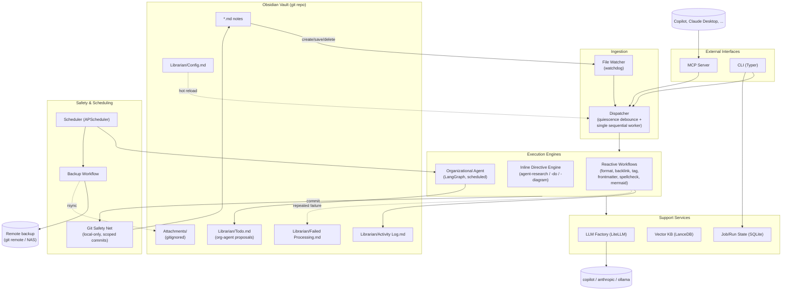

# Vault Librarian — High-Level Design

## 1. What this is

Vault Librarian is a local background service that watches an Obsidian vault
(a directory of Markdown files) and runs automated, agentic workflows against
it — reactively on file create/save/delete, on a schedule, and on demand via
MCP. It is a full rework of a prior, not-entirely-functional implementation;
this document describes the architecture from scratch.

## 2. Design principles

1. **Deterministic before LLM.** Anything mechanical (formatting, frontmatter
   schema, mermaid syntax) is validated/fixed with real parsers/linters, not
   an LLM guess. LLMs are reserved for genuinely fuzzy or generative tasks
   (backlink suggestions, tagging, spellcheck semantics, research, org
   proposals) and are used as an escalation path when deterministic fixes
   fail, never as the first attempt.
2. **Local-only safety net, independent of backup.** Every automated edit is
   git-committed locally for revert/audit. This is a *rollback* mechanism,
   not a *backup* mechanism, and never touches a remote.
3. **Single source of truth for exclusions.** One path-ignore list drives
   both what the file watcher processes and what `.gitignore` excludes
   (attachments, `.obsidian/`, templates, etc.).
4. **One thing at a time.** Global workflow concurrency is 1 (a single
   sequential worker over a FIFO queue). This is a local, single-user tool —
   simplicity and avoiding race conditions on git/vector-db writes beats
   throughput.
5. **Vault stays clean.** Librarian's own operational state (job history,
   vector DB, logs) lives outside the vault entirely, keyed by vault path, so
   vault git history only ever contains actual content changes.
6. **Config lives in the vault, state does not.** Users tune behavior via a
   Markdown config file inside the vault (hot-reloaded on save); the
   service's operational data directory is external.

## 3. System overview



## 4. Core components

### 4.1 File Watcher + Debouncer
- `watchdog` observes the vault root (minus ignore-list paths).
- **Quiescence-based debounce**, not a fixed delay: a per-file timer resets
  on every new event; the workflow only fires after N seconds of no further
  writes to that file. Configurable via `Config.md`.
- Feedback-loop guard: the dispatcher records the content hash of its own
  writes per path and suppresses the watcher event that write itself
  generates, preventing infinite reprocessing loops.

### 4.2 Dispatcher
- Single sequential worker consuming a FIFO queue of `(file)` tasks —
  global concurrency = 1. No per-file locking is needed because nothing
  runs concurrently.
- **Batched pipeline, not one task per workflow.** Each settle-event task
  runs *all* applicable reactive workflows for that file in one in-memory
  pipeline against a single read: frontmatter normalize → format →
  spellcheck → backlink/tag → mermaid validate/fix → directive scan. This
  yields a single write, a single clobber check, and a single commit per
  settle-event instead of one of each per workflow — shrinking the
  concurrent-edit race window and cutting git noise. (Directive execution
  that requires an LLM run, e.g. `<agent-research>`, is a separate task
  type — see 4.6 — since it only fires when a pending directive block
  exists, not on every save; if multiple directives are pending in one
  file they're still batched into one read/write/commit cycle.)
- Looks up per-file automation eligibility (frontmatter toggle) and
  per-workflow model tier from `Config.md` before enqueuing.
- **Conflict-marker guard**: if a file contains unresolved merge-conflict
  markers (`<<<<<<<`, `=======`, `>>>>>>>` at line start — e.g. from the
  user's own `git pull --rebase`/merge outside the service), no workflow
  in the pipeline runs against it. Applying formatting/spellcheck inside a
  conflict block would be meaningless and could make the conflict worse;
  the file is simply left alone until the user resolves it.
- **Live-edit clobber guard**: the file's mtime/hash is snapshotted when a
  task starts. Immediately before writing the result back, the dispatcher
  re-checks the on-disk mtime/hash — if it changed (the user kept typing
  while the workflow/LLM call was in flight), the write is aborted and the
  file is re-enqueued (re-debounced) instead of overwriting newer content.
  This is the mechanism that prevents lost keystrokes; the git safety net
  (4.9) only protects history *after* a write, not concurrent edits.
- **Revert detection (user vs. agent disagreement)**: the `file_state`
  table (4.19) records, per `(file, workflow)`, both the input hash a
  transform was applied to and the output hash it produced. If a new
  save's content hash matches a previously recorded *input* (pre-fix) hash
  for a workflow, that's recognized as the user having deliberately
  reverted the agent's change — the workflow is skipped for that run (not
  silently reapplied, which would fight the user), and Activity Log notes
  it plainly along with how to make the suppression permanent (the
  frontmatter `skip` list in 4.4). This only applies to the exact-revert
  case; unrelated edits that happen to touch the same file are processed
  normally. All agent/org-agent tasks share this same single queue and
  guards — there is no separate concurrent execution lane to reconcile
  against.

### 4.3 Reactive workflows (MVP)
Formatting, backlinking/tagging suggestions, frontmatter updates, spellcheck,
mermaid diagram validation. Each workflow is implemented as independently as
possible from the others; deterministic workflows (formatting, frontmatter
schema, mermaid syntax) do not invoke an LLM unless escalation is required.

**Mermaid validation/fix cascade** (verify → fix → reverify, LLM last):
1. Parse with the real mermaid parser (headless Node/`mermaid`/`mmdc`
   subprocess) to get an exact error + line/column.
2. Attempt deterministic auto-fix for known mechanical issues (unbalanced
   brackets/quotes, missing diagram-type header, stray characters).
3. If still invalid, escalate to an LLM fix agent, feeding it the raw source
   **and** the exact parser error (not just "it's broken"). Re-validate
   deterministically after each attempt; retry up to ~3x.
4. Still broken → logged to `Failed Processing.md`, never looped forever.

### 4.4 Frontmatter automation control
Granular, not a single blanket flag, and **opt-out by default** (automation
enabled unless disabled):
```yaml
vault-librarian:
  enabled: true
  skip: [spellcheck, backlink]
```

### 4.5 Inline "ignore" fences (Phase 2)
A lighter-weight companion to the frontmatter opt-out (4.4): frontmatter
`skip` is whole-file and per-workflow; sometimes what's needed is
per-region protection for a specific paragraph, quote, or snippet — one
that should still travel with the content if it's copied/moved elsewhere.
Grouped with the other agent directives below (4.6) as a Phase 2 feature
since it shares their invisible-HTML-comment convention and directive-like
fence syntax, even though — unlike `<agent-research>` et al. — it needs no
LLM call or `pending`/`running`/`done` lifecycle state; it's a pure
"don't touch" marker, not a task.

Marker syntax (identical to the example format shown for directives below):

```html
<!-- agent-ignore -->
This paragraph won't be reformatted, spellchecked, or otherwise touched
by any reactive workflow.
<!-- /agent-ignore -->
```

- Default scope is **all** reactive workflows and the directive scanner
  itself (including auto-fix of a mermaid block, if one is wrapped);
  an optional `workflows="format,spellcheck"` attribute on the opening
  marker narrows protection to specific workflows for power users.
- Implemented as a single shared **segmentation pre-pass** ahead of the
  batched pipeline (4.2): the dispatcher scans for `agent-ignore` regions,
  computes the protected spans, runs text-mutating workflows only against
  the unprotected segments, then reassembles the file. This is one shared
  utility, not per-workflow special-casing.
- Malformed/overlapping markers (e.g. a missing closing tag) are treated
  as a parse error — that specific region is left unprotected-but-also-
  unprocessed defensively and logged to `Failed Processing.md`, rather
  than crashing the whole file's pipeline.
- Scope boundary: this protects **content** within a file's body, not
  file-level operations — it has no bearing on the org-agent's (4.8)
  move/rename decisions for the file as a whole (that remains governed by
  frontmatter `enabled`/`skip`).
- Complements, not replaces, markdown's own implicit protection: workflows
  must already treat existing fenced/inline code spans as verbatim and
  never spellcheck/reformat inside them — `agent-ignore` extends that same
  protection to arbitrary **prose** the user wants left exactly as written.

### 4.6 Inline agent directives (Phase 2)
Directives are wrapped in real HTML comments so they render invisibly in
Obsidian's default Reading/Live Preview modes (verified: both `<!-- -->` and
`%% %%` are hidden there, visible only in Source mode) while the delivered
content stays as normal visible markdown between markers:

```html
<!-- agent-research status:pending -->
Azure Service Bus pricing
<!-- /agent-research -->
```

- States: `pending → running → done`. On completion the agent replaces the
  inner content with the result and preserves the original prompt as a
  hidden attribute on the opening comment (`orig:"..."`) so it can be
  re-run by resetting `status:pending`.
- Additional directive types planned: `<agent-do>` (todo execution),
  `<agent-diagram>` (mermaid generation), following the same lifecycle.
- Results carry a timestamp + model-used, so stale research can later be
  flagged for refresh.
- Directive execution is its own queue task type (distinct from the
  reactive-workflow pipeline in 4.2, since it only fires when a
  `status:pending` block exists rather than on every save), but is subject
  to the exact same guards: one read/write/commit cycle batches *all*
  pending directives in a file, the live-edit clobber guard discards a
  stale run if the user edits the prompt mid-execution (a fresh task with
  the new prompt is already queued from that edit), and the conflict-marker
  guard applies equally. Because directive markers are plain editable text,
  the user can always override the agent by editing or deleting a block —
  no separate conflict-resolution mechanism is needed there beyond that.

### 4.7 Vector KB (Phase 2)
LanceDB, embedded/file-based, stored outside the vault. Indexed
incrementally on workflow runs; used by directive/org agents as
vault-wide context. Cold-start backfill on a large existing vault is
throttled by the same global concurrency=1 queue — no separate rate-limit
mechanism needed.

### 4.8 Organizational agent (Phase 3)
- Scheduled (APScheduler) full-vault review; proposes moves/renames/
  restructuring into `Librarian/Todo.md` as checkboxes (chosen over a custom
  Obsidian-plugin form UI — zero extra tooling, native Obsidian editing).
- User checks/comments on proposals directly in `Todo.md`.
- On save-debounce or schedule, the org agent executes approved items.
- Multi-file operations (e.g. a rename touching backlinks across N files)
  are committed as **one atomic git transaction**, so a revert undoes the
  whole reorg cleanly, not a partial state.
- Internal reasoning notes are kept as hidden markdown comments, invisible
  to the user when reading normally.

### 4.9 Git safety net
- Local-only; never pushes/pulls/fetches from a remote.
- Uses the vault's existing repo if present, else `git init`s one.
- Distinct commit author (`Vault Librarian <vault-librarian@local>`) to
  separate automated history from manual edits in `git log`/`git blame`.
- Scoped `git add <touched files>` only — never `-A` — so it can never sweep
  up the user's own unstaged work.
- One commit per settle-event batch (or one atomic multi-file commit for
  org-agent transactions), message lists every workflow that touched the
  file this run, e.g. `vault-librarian(format,spellcheck): Note.md`.
- Attachments folder(s) are `.gitignore`d (see 4.11) — safety-net commits
  only ever touch `.md` files anyway.

### 4.10 Backup workflow (non-AI, scheduled)
Distinct concern from the safety net above:
- Scheduled (APScheduler cron) push of the vault's git history to a remote
  (private GitHub repo, or a local bare repo on external/NAS storage). This
  also captures the user's own manual edits for free, since it's the same
  repo.
- Because attachments are gitignored, a **separate rsync/rclone (or
  tarball) leg** backs up the attachments folder(s) on the same schedule —
  otherwise non-regeneratable user-dropped files (scans, screenshots) would
  silently have no backup path.

### 4.11 Attachments handling
- Obsidian's existing attachments-folder convention is respected;
  `.gitignore` excludes it (default sourced from `.obsidian/app.json`'s
  `attachmentFolderPath` if present, else user-declared in `Config.md`).
- Same ignore-list also excludes attachments from workflow processing (the
  md-only allowlist) — one list, two consumers.

### 4.12 LLM Factory
- **LiteLLM** as the unified call layer. Confirmed providers:
  - `github_copilot/*` — GitHub Copilot Chat API, OAuth device-flow auth
    handled natively by LiteLLM (no static key management needed).
  - `anthropic/*` — Claude, via API key.
  - `ollama/*` — local models, just another provider entry (not a separate
    "privacy tier" — selecting `ollama` for a workflow/note *is* the
    privacy control).
- **LangGraph** retained for multi-step orchestration (research directive,
  organizational agent) — checkpointing and human-in-the-loop interrupt
  patterns are still valuable there; dropped LangChain's per-provider LLM
  wrapper packages in favor of LiteLLM.
- **Model tiering** is configurable per workflow in `Config.md` with
  sensible defaults (cheap/fast model for reactive workflows, stronger
  model for research/org-agent).
- **Resilience is generic, not just for the mermaid fix cascade**: every
  LiteLLM call goes through a shared `tenacity`-based retry wrapper —
  exponential backoff on 429/5xx/timeout, capped attempts, both configurable
  per-provider in `Config.md` (`timeout_seconds`, `max_retries`).

### 4.13 Job/run state
SQLite (SQLAlchemy + aiosqlite), stored in the external state directory
(e.g. `~/.vault-librarian/<vault-id>/`), tracks workflow runs for future
job-history UI/CLI inspection.

### 4.14 Observability
- Tiered stdout logging (info/verbose/warning/error) while the service runs.
- `Librarian/Activity Log.md` — vault-resident, human-readable summary of
  automated actions.
- `Librarian/Failed Processing.md` — file + workflow + last error, appended
  once retries are exhausted (failure quarantine: stop retrying a file after
  N consecutive failures rather than looping forever).

### 4.15 MCP Server
Exposes workflows as on-demand tools to Copilot, Claude, and other MCP
clients, backed by the same dispatcher/queue as reactive/scheduled runs.
Binds to `127.0.0.1` only by default (not exposed on the network); an
optional bearer token in `Config.md` gates access for later remote/tunneled
use, but is off by default since MVP usage is local-only.

### 4.16 CLI
Typer-based. Service lifecycle, one-off workflow invocation, job history
inspection, and a `--dry-run` mode — important given the prior
implementation's reliability issues — to validate workflows against a real
vault copy before trusting them live. Also provides user-friendly wrappers
around the git safety net so raw `git` isn't required day-to-day:
`vault-librarian log <file>` (show librarian's edit history for a file) and
`vault-librarian rollback <file> [--commit <sha>]` (revert to a prior
automated or manual state).

### 4.17 Vault identification & state layout
- The vault is pointed at explicitly: `--vault <path>` CLI arg or
  `VAULT_LIBRARIAN_VAULT` env var. No auto-discovery for MVP.
- State directory is keyed by a hash of the vault's resolved real path:
  `~/.vault-librarian/<sha256(realpath)[:12]>/` (job DB, vector KB, logs).
- A small `~/.vault-librarian/vaults.json` maps hash → path so
  `vault-librarian list` can show known vaults in human-readable form.

### 4.18 `Config.md` schema
A fenced YAML block inside `Librarian/Config.md` — human-editable directly
in Obsidian, hot-reloaded on save:

```yaml
debounce_seconds: 20
workflows:
  format: {enabled: true, model: fast}
  backlink: {enabled: true, model: fast}
  frontmatter: {enabled: true, model: fast}
  spellcheck: {enabled: true, model: fast}
  mermaid: {enabled: true, model: fast}
  research_directive: {enabled: true, model: strong}
  org_agent: {enabled: false, model: strong, schedule: "0 6 * * *"}
models:
  fast: {provider: github_copilot, model: gpt-4.1-mini, timeout_seconds: 30, max_retries: 3}
  strong: {provider: anthropic, model: claude-sonnet, timeout_seconds: 60, max_retries: 3}
ignore_paths:
  - Attachments/
  - .obsidian/
  - Templates/
backup:
  enabled: false
  remote: null
  schedule: "0 3 * * *"
mcp:
  enabled: false
  bind: 127.0.0.1
  token: null
```

### 4.19 Concurrency & locking (LLD)

**Queue is an ordered set keyed by path, not a plain FIFO.** Debounce is
implemented as one `asyncio.Task` per pending path doing
`sleep(debounce_seconds)` then enqueue; a new event for the same path
cancels and restarts that task (standard asyncio debounce pattern). The
queue itself is a `dict[Path, Task]` (insertion-ordered) — if a file is
already sitting in the queue (debounced but not yet picked up by the
worker) and a new save arrives first, its snapshot is updated in place
rather than appending a second entry, so the same file is never processed
twice back-to-back for one burst of edits. The single worker coroutine
(`while True: path = queue.popleft(); await process(path)`) is what
enforces global concurrency = 1. Slow tasks (e.g. a research directive)
will head-of-line-block quick ones behind them — accepted for MVP (see the
deferred per-class-queue item in §7), but queue depth + current task are
exposed via the status endpoint (below) so a stuck run is visible.

**No OS-level locks on the notes themselves.** Obsidian's own save doesn't
know or coordinate with an external `flock` on a note, so a lock file
there would be theater. The real protection against a concurrent
third-party writer is the **clobber guard** in §4.2 (optimistic
concurrency: recheck mtime/hash immediately before write) — locking simply
isn't available against a writer that doesn't participate in it.

**What *is* actually locked:**
- **Git repository mutations** — the worker's per-run commits, the
  scheduled backup push, and any CLI/MCP-triggered rollback are three
  different call sites touching the same repo. All three go through a
  single `asyncio.Lock` so, e.g., a scheduled backup push can never race a
  workflow's commit.
- **Single-instance guard** — a PID lockfile
  (`~/.vault-librarian/<hash>/vault-librarian.lock`, acquired via
  `fcntl.flock`) prevents two `vault-librarian start` invocations against
  the same vault from both running watchers/writers concurrently.

**CLI/MCP share one control plane.** Rather than a separate IPC protocol,
the FastAPI process bound to `127.0.0.1` (§4.15) serves both the MCP
protocol routes and a small REST control API (`/status`, `/jobs`, `/run`).
CLI verbs that need the live service (`status`, `run <workflow> <file>`)
are thin HTTP clients against it. `log`/`rollback` remain standalone git
wrappers that work even when the service isn't running.

**Config hot-reload is validate-then-swap.** `Config.md` changes are
excluded from the reactive-workflow set (it's not processed like a note)
but stays git-tracked as a normal user edit. On save: parse and
pydantic-validate the full new config *before* swapping the in-memory
object; on validation failure, keep the old config and log the error
rather than crashing the service.

**Crash recovery / idempotency.** If the process dies after writing a file
but before committing, the working tree is left dirty. On startup, before
the watcher starts: run `git status --porcelain` and auto-commit any dirty
file as `vault-librarian(recovery): <file>` so the tree is clean before
normal operation resumes. A `file_state(path, workflow, input_hash,
output_hash, processed_at)` table in the job DB (one row per file+workflow,
recording both the pre-transform and post-transform content hash) means a
restart doesn't reprocess the whole vault — only files whose content hash
changed since the last known `output_hash` get caught up in a bounded,
throttled startup scan (same concurrency=1 queue, no separate rate-limit
mechanism needed). The same table drives revert-detection (4.2): a new
save matching a prior `input_hash` for a workflow is recognized as a
deliberate user revert rather than reprocessed.

**LanceDB/SQLite are single-writer by construction** — safe because the
PID lock guarantees exactly one process per vault. The job DB still runs
with `PRAGMA journal_mode=WAL` for future concurrent reads (e.g. a status
API being polled while the worker writes).

## 5. Tech stack summary

| Concern | Choice |
|---|---|
| File watching | watchdog |
| Debounce/queue | custom (quiescence timer + single-worker FIFO) |
| Agent orchestration | LangGraph |
| LLM calls | LiteLLM (`github_copilot/*`, `anthropic/*`, `ollama/*`) |
| Vector KB | LanceDB (embedded, file-based) |
| Job/run state | SQLAlchemy + aiosqlite (+ alembic for migrations) |
| Scheduling | APScheduler |
| Safety net | git (local-only, scoped commits, distinct author) |
| Backup | scheduled git push (remote) + rsync/rclone for attachments |
| API/MCP | FastAPI + MCP Python SDK |
| CLI | Typer |
| Config | Pydantic Settings (service-level) + vault-resident `Config.md` (user-tunable, hot-reloaded) |
| Retry/backoff | tenacity (wraps all LiteLLM calls) |

## 6. Package structure

```
src/vault_librarian/
  cli.py              # Typer entrypoints: start, stop, run, log, rollback, list, dry-run
  config.py           # Config.md parsing, validation, hot-reload
  state.py            # vault_id resolution, ~/.vault-librarian/<hash>/ layout, vaults.json
  watcher.py          # watchdog observer, ignore-list filtering
  dispatcher.py       # quiescence debounce, FIFO queue, single worker, clobber guard
  git_safety.py       # scoped commits, distinct author, rollback helpers
  backup.py           # scheduled remote push + attachment rsync leg
  workflows/
    format.py
    backlink.py
    frontmatter.py
    spellcheck.py
    mermaid.py        # parse -> deterministic autofix -> LLM-fix cascade
    segmentation.py   # agent-ignore span detection, shared pre-pass for all of the above
  directives/
    engine.py          # pending/running/done lifecycle, HTML-comment parsing
    research.py
    do.py
    diagram.py
  agents/
    org_agent.py        # LangGraph graph, Todo.md read/write
  llm/
    factory.py          # LiteLLM wrapper + tenacity retry policy
  kb/
    vector_store.py     # LanceDB
  jobs/
    models.py           # SQLAlchemy models
    store.py
  mcp_server.py          # FastAPI + MCP SDK, 127.0.0.1-bound
  logging_setup.py       # tiered stdout logging
tests/
  fixtures/vault/        # small sample Obsidian vault for integration tests
  unit/                  # per-workflow, deterministic-first, mocked LLM (litellm mock_response)
  integration/            # watcher -> dispatcher -> git_safety, using fixtures/vault
```

## 7. Open items for later phases
- Obsidian companion plugin (subsumes the "nice-to-have" terminal/web UI;
  bigger investment — separate TS/JS codebase against the Obsidian Plugin
  API) — deferred past Phase 3's Todo.md checkbox approach.
- Multi-vault support (one service instance managing several vaults).
- Splitting the single global queue into per-workflow-class queues (reactive
  vs. directive vs. org-agent) if a long-running directive (e.g. deep
  research) is found to unacceptably block reactive workflows in practice —
  deliberately deferred rather than solved upfront, since concurrency=1
  keeps the initial implementation simple and correctness-first.

## 8. Deployment & runtime
No external database *servers* to stand up — LanceDB and SQLite
(via `aiosqlite`) are both embedded, file-based libraries persisting under
`~/.vault-librarian/<vault-id>/`, and git is invoked as a subprocess/library
call, not a daemon. The entire system (watcher, dispatcher, scheduler,
MCP/REST control plane) is **one long-running process**, so "how to run
this" is a single-process deployment question, not multi-service
orchestration.

### 8.1 Native background service (recommended default, vault on the same Mac)
- Install via `uv tool install vault-librarian` (or `pipx`); register as a
  macOS `launchd` **user agent**
  (`~/Library/LaunchAgents/com.vault-librarian.plist`) invoking
  `vault-librarian run --vault <path>`, with `RunAtLoad` + `KeepAlive` for
  auto-start/auto-restart and stdout/stderr redirected to a log file.
  Linux equivalent: a systemd `--user` unit.
- Preferred by default because `watchdog` then uses native OS file-event
  APIs directly against the real filesystem (FSEvents on macOS, inotify on
  Linux) — no virtualization/translation layer between the watcher and the
  vault.
- Node.js + `mmdc` (mermaid CLI, used by the 4.3 validation cascade) is a
  documented host prerequisite, checked at startup with a clear error if
  missing rather than failing obscurely on first mermaid block.
- The single-instance PID lockfile (4.17) still applies, protecting against
  a duplicate `launchctl load` or a manual `vault-librarian run` racing the
  managed instance.

### 8.2 Containerized (podman / podman-compose) — remote vault or full reproducibility
- Useful when the vault lives on a NAS/remote box, or the whole toolchain
  (Python, Node/mmdc, pinned deps) should be reproducible without touching
  host installs.
- Bind-mount the vault directory and the external state directory
  (`~/.vault-librarian`) into the container; both need read-write access.
- **FS-event caveat**: Podman on macOS runs containers inside a Linux VM
  (`podman machine`), so a bind-mounted host directory is not watched via
  native FSEvents from inside that VM. `watchdog` must fall back to its
  `PollingObserver` (a config flag) to reliably observe host-side edits,
  trading a small added latency (poll interval, e.g. 1s) for correctness.
  This caveat doesn't apply on a native Linux host.
- **Control-plane binding caveat**: 4.15's `127.0.0.1`-only bind assumes the
  MCP/REST server and its clients (Claude Desktop, Copilot CLI) share a
  loopback. Inside a container, `127.0.0.1` is the container's own
  namespace, not the host's — publish the port pinned to the host loopback
  explicitly (`podman run -p 127.0.0.1:8765:8765 ...`), never to `0.0.0.0`.
- Ollama, if configured as a provider, is treated as an independent,
  already-running endpoint (native app or its own container) referenced via
  `base_url` in `Config.md` — vault-librarian does not start, stop, or
  otherwise manage Ollama's lifecycle.
- A `podman-compose.yml` for the service (and, optionally, an
  `ollama/ollama` sidecar) is a Phase 1 implementation deliverable, not
  something to hand-author at design time.

**Default recommendation**: native `launchd` agent for the common case
(vault and Obsidian on the same Mac); containerized only when the vault is
remote or cross-machine reproducibility matters more than FS-event latency.

