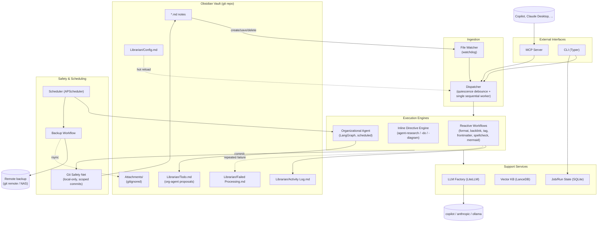

# Vault Librarian — High-Level Design

## 1. What this is

Vault Librarian is a local background service that watches an Obsidian vault
(a directory of Markdown files) and runs automated, agentic workflows against
it — reactively on file create/save/delete, on a schedule, and on demand via
MCP. It is a full rework of a prior, not-entirely-functional implementation;
this document describes the architecture from scratch.

## 2. Design principles

1. **Deterministic before LLM.** Anything mechanical (formatting, frontmatter
   schema, mermaid syntax) is validated/fixed with real parsers/linters, not
   an LLM guess. LLMs are reserved for genuinely fuzzy or generative tasks
   (backlink suggestions, tagging, spellcheck semantics, research, org
   proposals) and are used as an escalation path when deterministic fixes
   fail, never as the first attempt.
2. **Local-only safety net, independent of backup.** Every automated edit is
   git-committed locally for revert/audit. This is a *rollback* mechanism,
   not a *backup* mechanism, and never touches a remote.
3. **Single source of truth for exclusions.** One path-ignore list drives
   both what the file watcher processes and what `.gitignore` excludes
   (attachments, `.obsidian/`, templates, etc.).
4. **One thing at a time.** Global workflow concurrency is 1 (a single
   sequential worker over a FIFO queue). This is a local, single-user tool —
   simplicity and avoiding race conditions on git/vector-db writes beats
   throughput.
5. **Vault stays clean.** Librarian's own operational state (job history,
   vector DB, logs) lives outside the vault entirely, keyed by vault path, so
   vault git history only ever contains actual content changes.
6. **Config lives in the vault, state does not.** Users tune behavior via a
   Markdown config file inside the vault (hot-reloaded on save); the
   service's operational data directory is external.

## 3. System overview



## 4. Core components

### 4.1 File Watcher + Debouncer
- `watchdog` observes the vault root (minus ignore-list paths).
- **Quiescence-based debounce**, not a fixed delay: a per-file timer resets
  on every new event; the workflow only fires after N seconds of no further
  writes to that file. Configurable via `Config.md`.
- Feedback-loop guard: the dispatcher records the content hash of its own
  writes per path and suppresses the watcher event that write itself
  generates, preventing infinite reprocessing loops.

### 4.2 Dispatcher
- Single sequential worker consuming a FIFO queue of `(file, workflow)`
  tasks — global concurrency = 1. No per-file locking is needed because
  nothing runs concurrently.
- Looks up per-file automation eligibility (frontmatter toggle) and
  per-workflow model tier from `Config.md` before enqueuing.

### 4.3 Reactive workflows (MVP)
Formatting, backlinking/tagging suggestions, frontmatter updates, spellcheck,
mermaid diagram validation. Each workflow is implemented as independently as
possible from the others; deterministic workflows (formatting, frontmatter
schema, mermaid syntax) do not invoke an LLM unless escalation is required.

**Mermaid validation/fix cascade** (verify → fix → reverify, LLM last):
1. Parse with the real mermaid parser (headless Node/`mermaid`/`mmdc`
   subprocess) to get an exact error + line/column.
2. Attempt deterministic auto-fix for known mechanical issues (unbalanced
   brackets/quotes, missing diagram-type header, stray characters).
3. If still invalid, escalate to an LLM fix agent, feeding it the raw source
   **and** the exact parser error (not just "it's broken"). Re-validate
   deterministically after each attempt; retry up to ~3x.
4. Still broken → logged to `Failed Processing.md`, never looped forever.

### 4.4 Frontmatter automation control
Granular, not a single blanket flag, and **opt-out by default** (automation
enabled unless disabled):
```yaml
vault-librarian:
  enabled: true
  skip: [spellcheck, backlink]
```

### 4.5 Inline agent directives (Phase 2)
Directives are wrapped in real HTML comments so they render invisibly in
Obsidian's default Reading/Live Preview modes (verified: both `<!-- -->` and
`%% %%` are hidden there, visible only in Source mode) while the delivered
content stays as normal visible markdown between markers:

```html
<!-- agent-research status:pending -->
Azure Service Bus pricing
<!-- /agent-research -->
```

- States: `pending → running → done`. On completion the agent replaces the
  inner content with the result and preserves the original prompt as a
  hidden attribute on the opening comment (`orig:"..."`) so it can be
  re-run by resetting `status:pending`.
- Additional directive types planned: `<agent-do>` (todo execution),
  `<agent-diagram>` (mermaid generation), following the same lifecycle.
- Results carry a timestamp + model-used, so stale research can later be
  flagged for refresh.

### 4.6 Vector KB (Phase 2)
LanceDB, embedded/file-based, stored outside the vault. Indexed
incrementally on workflow runs; used by directive/org agents as
vault-wide context. Cold-start backfill on a large existing vault is
throttled by the same global concurrency=1 queue — no separate rate-limit
mechanism needed.

### 4.7 Organizational agent (Phase 3)
- Scheduled (APScheduler) full-vault review; proposes moves/renames/
  restructuring into `Librarian/Todo.md` as checkboxes (chosen over a custom
  Obsidian-plugin form UI — zero extra tooling, native Obsidian editing).
- User checks/comments on proposals directly in `Todo.md`.
- On save-debounce or schedule, the org agent executes approved items.
- Multi-file operations (e.g. a rename touching backlinks across N files)
  are committed as **one atomic git transaction**, so a revert undoes the
  whole reorg cleanly, not a partial state.
- Internal reasoning notes are kept as hidden markdown comments, invisible
  to the user when reading normally.

### 4.8 Git safety net
- Local-only; never pushes/pulls/fetches from a remote.
- Uses the vault's existing repo if present, else `git init`s one.
- Distinct commit author (`Vault Librarian <vault-librarian@local>`) to
  separate automated history from manual edits in `git log`/`git blame`.
- Scoped `git add <touched files>` only — never `-A` — so it can never sweep
  up the user's own unstaged work.
- One commit per workflow run (or one atomic multi-file commit for org-agent
  transactions), message format `vault-librarian(<workflow>): <file>`.
- Attachments folder(s) are `.gitignore`d (see 4.10) — safety-net commits
  only ever touch `.md` files anyway.

### 4.9 Backup workflow (non-AI, scheduled)
Distinct concern from the safety net above:
- Scheduled (APScheduler cron) push of the vault's git history to a remote
  (private GitHub repo, or a local bare repo on external/NAS storage). This
  also captures the user's own manual edits for free, since it's the same
  repo.
- Because attachments are gitignored, a **separate rsync/rclone (or
  tarball) leg** backs up the attachments folder(s) on the same schedule —
  otherwise non-regeneratable user-dropped files (scans, screenshots) would
  silently have no backup path.

### 4.10 Attachments handling
- Obsidian's existing attachments-folder convention is respected;
  `.gitignore` excludes it (default sourced from `.obsidian/app.json`'s
  `attachmentFolderPath` if present, else user-declared in `Config.md`).
- Same ignore-list also excludes attachments from workflow processing (the
  md-only allowlist) — one list, two consumers.

### 4.11 LLM Factory
- **LiteLLM** as the unified call layer. Confirmed providers:
  - `github_copilot/*` — GitHub Copilot Chat API, OAuth device-flow auth
    handled natively by LiteLLM (no static key management needed).
  - `anthropic/*` — Claude, via API key.
  - `ollama/*` — local models, just another provider entry (not a separate
    "privacy tier" — selecting `ollama` for a workflow/note *is* the
    privacy control).
- **LangGraph** retained for multi-step orchestration (research directive,
  organizational agent) — checkpointing and human-in-the-loop interrupt
  patterns are still valuable there; dropped LangChain's per-provider LLM
  wrapper packages in favor of LiteLLM.
- **Model tiering** is configurable per workflow in `Config.md` with
  sensible defaults (cheap/fast model for reactive workflows, stronger
  model for research/org-agent).

### 4.12 Job/run state
SQLite (SQLAlchemy + aiosqlite), stored in the external state directory
(e.g. `~/.vault-librarian/<vault-id>/`), tracks workflow runs for future
job-history UI/CLI inspection.

### 4.13 Observability
- Tiered stdout logging (info/verbose/warning/error) while the service runs.
- `Librarian/Activity Log.md` — vault-resident, human-readable summary of
  automated actions.
- `Librarian/Failed Processing.md` — file + workflow + last error, appended
  once retries are exhausted (failure quarantine: stop retrying a file after
  N consecutive failures rather than looping forever).

### 4.14 MCP Server
Exposes workflows as on-demand tools to Copilot, Claude, and other MCP
clients, backed by the same dispatcher/queue as reactive/scheduled runs.

### 4.15 CLI
Typer-based. Service lifecycle, one-off workflow invocation, job history
inspection, and a `--dry-run` mode — important given the prior
implementation's reliability issues — to validate workflows against a real
vault copy before trusting them live.

## 5. Tech stack summary

| Concern | Choice |
|---|---|
| File watching | watchdog |
| Debounce/queue | custom (quiescence timer + single-worker FIFO) |
| Agent orchestration | LangGraph |
| LLM calls | LiteLLM (`github_copilot/*`, `anthropic/*`, `ollama/*`) |
| Vector KB | LanceDB (embedded, file-based) |
| Job/run state | SQLAlchemy + aiosqlite (+ alembic for migrations) |
| Scheduling | APScheduler |
| Safety net | git (local-only, scoped commits, distinct author) |
| Backup | scheduled git push (remote) + rsync/rclone for attachments |
| API/MCP | FastAPI + MCP Python SDK |
| CLI | Typer |
| Config | Pydantic Settings (service-level) + vault-resident `Config.md` (user-tunable, hot-reloaded) |

## 6. Open items for later phases
- Obsidian companion plugin (subsumes the "nice-to-have" terminal/web UI;
  bigger investment — separate TS/JS codebase against the Obsidian Plugin
  API) — deferred past Phase 3's Todo.md checkbox approach.
- Multi-vault support (one service instance managing several vaults).
