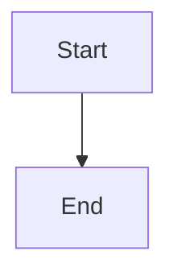

---
vault-librarian:
  enabled: true
---

# Sample Note

A small fixture note used by integration tests (watcher/dispatcher/git-safety).

## Diagram

```mermaid
flowchart TD
    A[Start] --> B[End]
```
